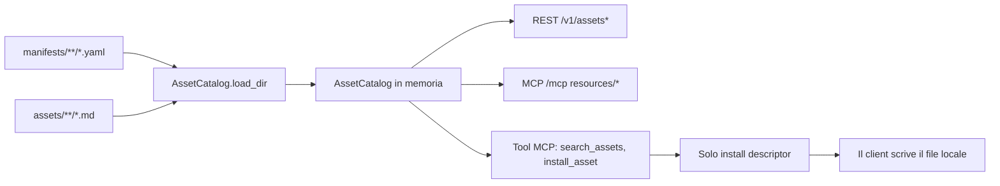

# MCP Catalog - Scaffold MVP

Scaffold FastAPI eseguibile per un control plane di catalogo MCP modelless.

Questo servizio è intenzionalmente semplice e con scelte architetturali precise:

- distribuisce asset versionati (skill, agent, prompt, policy);
- non esegue gli asset;
- non ospita e non invoca alcun modello;
- espone sia endpoint REST sia un endpoint MCP JSON-RPC.

Ragionamento ed esecuzione avvengono sempre nel modello locale del client.

> Questo scaffold è un punto di partenza da copiare nel futuro repository
> dedicato `mcp-catalog`. Vedi [../NEXT_STEPS.md](../NEXT_STEPS.md).

## Cosa È (E Cosa Non È) Questo Servizio

Questo servizio è un catalogo e un server di metadati.

- Fonte di verità: manifest YAML sotto `manifests/`.
- Sorgente del contenuto: file body Markdown sotto `assets/` (quando si usa `body_file`).
- Comportamento runtime: API di catalogo in sola lettura + generazione del descriptor di installazione.

Questo servizio non è:

- un runtime di modelli;
- un esecutore di skill;
- una sandbox plugin;
- una API di registrazione runtime.

L'endpoint REST `POST /v1/assets` non è presente per scelta progettuale.

## Architettura Di Alto Livello



## Struttura Del Repository (Stato Attuale)

```text
mcp-server-scaffold/
|- app/
|  |- __init__.py
|  |- main.py                 # endpoint FastAPI + wiring di startup
|  |- mcp_protocol.py         # dispatcher MCP JSON-RPC e tool
|  |- catalog.py              # modello asset + load/search/get del catalogo
|  |- auth.py                 # stub di autenticazione per sviluppo
|  \- tenants.py              # configurazione override tenant
|- assets/
|  |- __init__.py
|  |- agents/
|  |- policies/
|  |- prompts/
|  |- skills/
|  \- plugins/
|- manifests/
|  |- manifests.md            # riferimento schema manifest
|  |- agents/
|  |- policies/
|  |- prompts/
|  |- skills/
|  |- plugins/
|  \- _templates/            # non caricata a runtime
|- tests/
|- Dockerfile
|- docker-compose.yml
|- requirements.txt
|- requirements-dev.txt
\- pytest.ini
```

Note:

- Il caricamento runtime è ricorsivo (`rglob("*.yaml")`) e salta soltanto `_templates`.
- Mantieni un solo manifest per ogni id asset. Id duplicati sono possibili a livello filesystem,
  ma in memoria si sovrascrivono durante il load (vince l'ultimo caricato).

## Sequenza Di Startup (Percorso Di Studio)

1. `app/main.py` definisce `MANIFESTS_DIR`.
2. Viene creato `AssetCatalog()`.
3. `catalog.load_dir(MANIFESTS_DIR)` carica e registra tutti i manifest.
4. Le route FastAPI diventano disponibili.

Mappa del codice:

- `app/main.py`: wiring di startup e route;
- `app/catalog.py`: parsing dei manifest e registrazione asset;
- `app/mcp_protocol.py`: dispatcher metodi JSON-RPC.

## Modello Dati Asset

Ogni asset registrato include almeno:

- `id`, `kind`, `name`, `version`;
- `description`, `visibility`;
- `install_target` (derivato da `install.target_path` nel manifest);
- `body` (inline o risolto tramite `body_file`).

Da questi dati il servizio produce:

- summary (`id`, `kind`, `name`, `version`, `visibility`, `description`);
- vista manifest (`digest`, `body_ref`, `install.target_path`);
- install descriptor (contenuto ancorato per hard install).

### Priorità Di Risoluzione Del Body

In `register_dict`:

1. `body` (inline);
2. solo per i prompt: `template`;
3. `body_file` caricato da `assets/<path-del-manifest>`.

Se nessuna sorgente è disponibile, la registrazione fallisce.

## Superficie REST

### Health

- `GET /v1/health`

Restituisce stato del servizio, versione e uptime.

### Lista / Ricerca Catalogo

- `GET /v1/assets`
- Query param:
  - `kind` opzionale;
  - `q` opzionale.

Restituisce i summary degli asset.

### Vista Manifest Di Un Asset

- `GET /v1/assets/{asset_id}`

Restituisce summary + digest + riferimento al body + target di installazione.

### Descriptor Di Hard Install

- `GET /v1/assets/{asset_id}/install`

Restituisce il descriptor con contenuto ancorato:

- `source: mcp-catalog`;
- `source_version`;
- `source_digest`.

Il server non scrive su disco. Il client scrive `content` in `target_path`.

### Override Tenant

- `GET /v1/tenants/{tenant_id}/overrides`
- `PUT /v1/tenants/{tenant_id}/overrides` (richiede ruolo admin)

## Superficie MCP JSON-RPC (`POST /mcp`)

Metodi supportati:

- `initialize`;
- `notifications/initialized` (notification, HTTP 204);
- `ping`;
- `resources/list`;
- `resources/read`;
- `prompts/list`;
- `prompts/get` (MVP: nessun registro prompt dedicato, ritorna not found);
- `tools/list`;
- `tools/call`.

Schema URI delle risorse:

- `catalog://{asset_id}`.

### Ephemeral Load Vs Hard Install

- `resources/read`: restituisce il body grezzo per il contesto della sessione corrente (senza ancoraggio).
- tool `install_asset` oppure endpoint REST di installazione: restituisce descriptor ancorato
  per installazione locale persistente.

## Tool MCP (Dettaglio)

I due tool sono implementati in `app/mcp_protocol.py`:

- `search_assets`;
- `install_asset`.

### 1) `search_assets`

Scopo:

- scoprire asset del catalogo tramite testo libero e kind opzionale.

Schema input:

- `query` stringa opzionale;
- `kind` stringa opzionale.

Comportamento:

- se `query` è presente: usa la ricerca catalogo;
- altrimenti: usa la lista catalogo;
- restituisce solo summary.

Nessun side effect.

### 2) `install_asset`

Scopo:

- restituire un descriptor di hard install per un singolo id asset.

Schema input:

- `asset_id` stringa obbligatoria.

Comportamento:

- risolve l'asset per id;
- restituisce descriptor ancorato (`target_path`, `content`, `source_digest`, ecc.).

Nessun side effect (nessuna scrittura file lato server).

### Semantica Degli Errori Tool

- Nome tool sconosciuto -> errore JSON-RPC (`-32602`).
- Tool noto con errore runtime (argomenti mancanti, id asset sconosciuto) ->
  risposta JSON-RPC di successo con `result.isError: true` e testo errore in content.

Questa scelta è intenzionale per permettere al client di ragionare sugli errori a livello tool.

## Workflow Di Authoring Dei Manifest

### Workflow manuale

1. Parti da `manifests/_templates/<kind>.yaml`.
2. Compila i campi obbligatori (`id`, `kind`, `name`, `version`, `description`,
   `install.target_path` e body/body_file).
3. Salva sotto `manifests/<kind-plural>/` (raccomandato).
4. Aggiungi il body file sotto `assets/<kind-plural>/` se usi `body_file`.
5. Riavvia il servizio.

### Workflow assistito raccomandato

Usa la skill:

- [../../../.github/skills/add-catalog-asset/SKILL.md](../../../.github/skills/add-catalog-asset/SKILL.md)

La skill inferisce kind/id/description, scrive manifest + body file e mantiene il processo deterministico.

## Regole Su ID E Collisioni (Importante)

`AssetCatalog` è indicizzato globalmente per `id` (non per coppia kind+id).

Implicazioni:

- una `skill` e un `prompt` non possono condividere lo stesso id;
- un manifest caricato successivamente con lo stesso id sovrascrive il precedente in memoria.

Convenzione consigliata:

- mantieni id canonici per le skill (per esempio `mermaid-flow`);
- aggiungi suffisso `-prompt` ai prompt in collisione (per esempio `mermaid-flow-prompt`).

## Sviluppo Locale

```powershell
cd mcp_blueprint/modelless-mcp/mcp-server-scaffold
python -m venv .venv
.\.venv\Scripts\Activate.ps1
pip install -r requirements-dev.txt
$env:MCP_AUTH_DISABLED = "1"
uvicorn app.main:app --reload --port 8080
```

Apri: http://127.0.0.1:8080/docs

## Comandi Rapidi Di Verifica

```powershell
# REST
curl http://127.0.0.1:8080/v1/health
curl http://127.0.0.1:8080/v1/assets
curl "http://127.0.0.1:8080/v1/assets?q=mermaid&kind=skill"
curl http://127.0.0.1:8080/v1/assets/mermaid-flow
curl http://127.0.0.1:8080/v1/assets/mermaid-flow/install
```

```powershell
# JSON-RPC: tools/list
$body = @{ jsonrpc = "2.0"; id = 1; method = "tools/list" } | ConvertTo-Json
Invoke-RestMethod -Method Post -Uri http://127.0.0.1:8080/mcp -ContentType "application/json" -Body $body
```

```powershell
# JSON-RPC: tools/call search_assets
$body = @{
  jsonrpc = "2.0"
  id = 2
  method = "tools/call"
  params = @{ name = "search_assets"; arguments = @{ query = "mermaid" } }
} | ConvertTo-Json -Depth 6
Invoke-RestMethod -Method Post -Uri http://127.0.0.1:8080/mcp -ContentType "application/json" -Body $body
```

## Connessione A VS Code MCP

Configura `.vscode/mcp.json`:

```json
{
  "servers": {
    "mcp-catalog-local": {
      "type": "http",
      "url": "http://127.0.0.1:8080/mcp"
    }
  }
}
```

Poi connettiti e usa:

- List Resources;
- Read Resource (`catalog://<id>`);
- Tools (`search_assets`, `install_asset`).

## Test

```powershell
$env:MCP_AUTH_DISABLED = "1"
pytest --cov=app --cov-report=term-missing
```

## Risoluzione Problemi

### `docker compose up --build` termina con codice 1

1. Controlla i log:

```powershell
docker compose logs --tail=200
```

2. Verifica validità YAML e campi obbligatori nei nuovi manifest:

- `id`, `kind`, `name`, `version`;
- `install.target_path`;
- uno tra `body`, `body_file` o `template` (prompt).

3. Riesegui i test in locale per intercettare presto eventuali errori di load del catalogo.

### Un asset risulta mancante

1. Conferma che il file manifest sia sotto `manifests/` (non in `_templates`).
2. Conferma che il path `body_file` esista sotto `assets/`.
3. Riavvia app/container.

### Asset inatteso restituito per un id

Probabile collisione di id tra manifest. Cerca l'id e mantieni un solo manifest canonico.

## Note Su Sicurezza E Autenticazione

- `app/auth.py` è uno stub per sviluppo;
- `MCP_AUTH_DISABLED=1` assegna principal admin in locale e nei test;
- senza quella variabile, il formato token è `dev.<tenant_id>.<subject>.<role>`
  (placeholder, non è validazione JWT production-grade).

Prima di un deployment condiviso, sostituisci con validazione JWT Azure AD completa
(firma JWKS, audience, expiry, issuer).

## Riferimenti

- [manifests/manifests.md](manifests/manifests.md)
- [app/mcp_protocol.py](app/mcp_protocol.py)
- [app/catalog.py](app/catalog.py)
- [../docs/learn/MCP-overview.md](../docs/learn/MCP-overview.md)
- [../plan/implementation_plan.md](../plan/implementation_plan.md)
