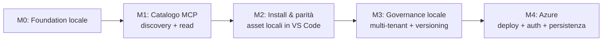
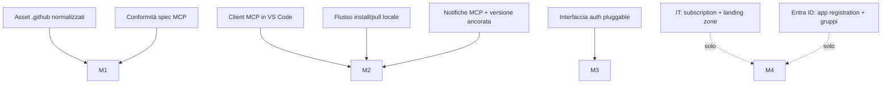

# Piano di implementazione — Catalogo MCP di asset AI (modelless)

> Documento in italiano (parte didattica/pianificazione). I deliverable tecnici
> referenziati sono in inglese. Le stime sono in **giorni-uomo (gg)** indicative e
> vanno ricalibrate con il team reale.

## 1. Obiettivo e principio guida

Costruire un **catalogo centralizzato di asset AI** — sul modello di
[github/awesome-copilot](https://github.com/github/awesome-copilot) — servito via
**MCP** e **senza modelli** (*modelless*). Il catalogo raccoglie **agenti,
istruzioni, skill, prompt e plugin** (bundle) e li rende **scopribili e installabili
in locale** dall'utente. Una volta installati, gli asset vengono usati con il
**modello locale** del client (VS Code + Copilot): il server **non ospita né chiama
alcun modello** e **non esegue logica applicativa**.

> Il server è un **catalogo/marketplace di strumenti AI**, non un motore di
> esecuzione. Non ci sono "tool deterministici" lato server: il server **distribuisce
> asset**, il client **li installa** e il **modello locale** li usa.

**Principio guida n.1 — esperienza "awesome-copilot" in azienda**: come su
awesome-copilot, l'utente **naviga, cerca, filtra** e **installa** un asset con un
comando; da quel momento l'asset vive in locale (`.github/…`) e si comporta
esattamente come se lo avesse scritto lui. Il valore è la **centralizzazione, il
versionamento e la governance** di un catalogo condiviso tra team.

**Principio guida n.2 — parità col locale**: un asset installato dal catalogo deve
comportarsi **identicamente** al corrispettivo scritto a mano in `.github/`. Cambia
**solo la provenienza** (catalogo anziché filesystem), non il comportamento.

**Principio guida n.3 — prima locale, poi Azure**: si costruisce e si **valida
end-to-end il catalogo in locale** (eseguibile e testabile senza cloud). Solo **alla
fine** lo si porta su Azure (identità aziendale, persistenza gestita, deploy).

## 2. Modello di catalogo (cosa contiene e come si consuma)

| Tipo di asset | Cos'è | Come lo consuma l'utente |
|---|---|---|
| 🤖 Agente | Definizione di un agente/chatmode (ruolo, handoff, tool consentiti) | Load in sessione **o** install in locale, orchestrato dal **modello locale** |
| 📋 Istruzione | Convenzioni applicate per pattern di file (`applyTo`) | Load **o** install; il modello locale la applica come grounding |
| 🎯 Skill | Cartella con istruzioni + asset allegati (non codice server) | Load **o** install; il modello locale la segue |
| 💬 Prompt | Prompt riutilizzabile con argomenti (`/comando`) | Invocabile via MCP `prompts/*` **o** installato in locale |
| 🔌 Plugin | Bundle curato di agenti/skill/istruzioni per un workflow | Installato in blocco |

### 2.1 Due modalità di consumo

Ogni asset si può consumare in **due modi complementari** (entrambi da supportare):

- **Load effimero (via MCP)**: il contenuto dell'asset viene **iniettato come
  contesto** nella sessione/chat corrente (`resources/read`, `prompts/get`). È
  **temporaneo**: non registra una chat mode e quindi **non appare nel selettore**
  degli agenti; sparisce con la sessione. Utile per prova rapida / uso occasionale.
- **Install persistente (pull su file locale)**: l'asset viene **materializzato come
  file** nel workspace/profilo (es. agente → `.github/agents/<nome>.agent.md` o
  `.github/chatmodes/<nome>.chatmode.md`, istruzione → `.github/instructions/…`,
  ecc.). VS Code lo rileva e diventa **selezionabile a mano**, identico a un asset
  scritto dall'utente. È la modalità che dà **parità piena** col locale.

Operazioni del catalogo (nessuna esegue AI lato server):
**browse / search / filter** (scoperta), **read/load** (dettaglio e load effimero in
sessione), **install/pull** (materializza l'asset come file locale),
**index machine-readable** (stile `llms.txt`), **notify/update** (avviso di
aggiornamenti agli asset, vedi §2.2).

### 2.2 Aggiornamenti e allineamento delle versioni

Gli asset del catalogo cambiano nel tempo; un utente può avere una versione **vecchia
installata**. Le due modalità si comportano diversamente:

- **Load effimero**: sempre fresco. Il server può **spingere notifiche** ai client
  già connessi — `notifications/resources/list_changed` (il catalogo è cambiato),
  `notifications/resources/updated` (singola resource, previa `resources/subscribe`),
  `notifications/prompts/list_changed`. Al prossimo `resources/read` il client rilegge
  la versione aggiornata.
- **Install persistente (file locale)**: il file installato è una **copia
  scollegata**, le notifiche MCP non lo toccano. Serve **drift detection**:
  1. all'install si **ancora la versione** nel frontmatter (`source: mcp-catalog`,
     `source_version`, `source_digest: sha256:…`);
  2. il catalogo espone la **versione corrente** di ogni asset (in `resources/list`
     e nell'indice `llms.txt`);
  3. il client, all'`initialize` o su `list_changed`, **confronta** le versioni
     installate con quelle del catalogo e segnala *“aggiornamento disponibile:
     `qa-orchestrator` 1.4.2 → 1.5.0”*, offrendo un comando di **re-install/pull**.

> Prototipo esistente: `central-repo/examples/notifier/notify.py` diffa due stati
> dell'indice (`index.json` precedente vs corrente) — è il mattone del punto 3.

## 3. Milestone

Le milestone M0→M3 sono **interamente locali**: nessuna dipendenza cloud. M4 è
l'unica milestone Azure. Dopo M2 esiste già un **catalogo usabile in VS Code**.

---

## 4. M0 — Foundation locale (prerequisiti)

**Obiettivo**: repo, scaffold, decisioni architetturali e **ingestione degli asset**
esistenti da `.github/` nel catalogo. Nessun cloud.

| Task | Dettaglio | Stima | Prerequisiti |
|---|---|---|---|
| Nuovo repository `mcp-catalog` | Creazione repo, branch policy, CODEOWNERS | 0.5 gg | Accesso Git aziendale |
| Creare scaffold | Scrivere scaffold del catalogo nel nuovo repo | 0.5 gg | Repo creato |
| ADR iniziali | Formalizzare le decisioni (vedi Architettura) | 1 gg | — |
| Asset ingestion locale | Parser di `.github/{agents,prompts,skills,instructions}` → voci di catalogo normalizzate | 2 gg | Scaffold |
| Storage locale file-based | Catalogo su filesystem, zero servizi esterni | 1 gg | Ingestion |
| Indice machine-readable | Generare un indice tipo `llms.txt` di tutti gli asset | 0.5 gg | Ingestion |

**Criteri di accettazione M0**: lo scaffold builda e passa i test in CI; un comando
locale carica **tutti** gli asset del repo, li normalizza e produce l'indice. Nessuna
risorsa Azure.

**Rischi**: eterogeneità dei frontmatter degli asset → definire uno schema di
normalizzazione unico (vedi [mcp-server-scaffold/manifests/manifests.md](../mcp-server-scaffold/manifests/manifests.md)).

---

## 5. M1 — Catalogo MCP: discovery e retrieval (locale)

**Obiettivo**: il valore centrale. Parlare il **protocollo MCP** (Streamable HTTP /
stdio) ed esporre il **catalogo** per **scoperta e lettura**, così che un client MCP
reale (VS Code) si connetta, **cerchi** e **legga** gli asset. Nessuna esecuzione
lato server.

| Task | Dettaglio | Stima | Prereq |
|---|---|---|---|
| MCP protocol handler | `initialize`, `resources/list`, `resources/read`, `prompts/list`, `prompts/get` | 3.5 gg | M0 |
| Asset → resource | Ogni voce di catalogo (agente/istruzione/skill/plugin) esposta come **resource** leggibile con metadati | 2 gg | Handler |
| Prompt del catalogo | Prompt riutilizzabili esposti via `prompts/*` con argomenti tipizzati | 1.5 gg | Handler |
| Discovery: search & filter | Ricerca full-text + filtri (tipo, tag, team) sul catalogo | 2 gg | Handler |
| Versione per asset | Ogni resource espone versione + digest (in `resources/list` e `llms.txt`) | 1 gg | Asset → resource |
| Notifiche di aggiornamento | `resources/subscribe` + `notifications/{resources/updated,resources/list_changed,prompts/list_changed}` | 2 gg | Handler |
| Trasporto locale | stdio + HTTP locale, senza auth (dev) | 1 gg | Handler |
| Test protocollo (contract) | Client MCP di test: list/read/get + search + subscribe/notify su tutti gli asset | 2 gg | Tutto sopra |

**Criteri di accettazione M1**: un client MCP (o test client) esegue `resources/list`,
`resources/read`, `prompts/get` e una **ricerca** sul catalogo in locale; il
`resources/read` realizza il **load effimero** in sessione; una modifica a un asset
genera una **notifica** (`resources/updated` / `list_changed`) al client sottoscritto;
nessuna chiamata a
modelli; coverage core ≥ 80%.

**Rischi**: aderenza alla spec MCP → usare un test client conforme come oracolo fin
da subito.

---

## 6. M2 — Install & parità con il locale (in VS Code)

**Obiettivo**: chiudere il cerchio "awesome-copilot": dal client l'utente **naviga,
cerca** un asset e lo consuma in **due modi** — **load effimero** in sessione oppure
**install persistente** su file locale — usandolo con il **modello locale** con lo
stesso comportamento del corrispettivo scritto a mano. Ancora **zero cloud**.

| Task | Dettaglio | Stima | Prereq |
|---|---|---|---|
| Connessione VS Code ↔ catalogo MCP | Voce `settings.json`, discovery asset in-IDE | 1.5 gg | M1 |
| Load effimero in sessione | Caricare un asset come contesto della chat corrente (temporaneo) | 1 gg | M1 |
| Flusso di install/pull | Comando che **materializza** l'asset come file in `.github/…` (agente → `.agent.md`/`.chatmode.md`, ecc.) | 2.5 gg | M1 |
| Versione ancorata all'install | Scrivere `source`/`source_version`/`source_digest` nel frontmatter installato | 1 gg | Install |
| Drift detection & re-install | Confronto versione installata vs catalogo; alert *“update disponibile X→Y”* + comando di re-install | 2 gg | Versione ancorata, M1 notifiche |
| Selezione a mano post-install | L'agente installato **appare nel selettore** delle chat mode come uno locale | 1 gg | Install |
| Install di plugin (bundle) | Installazione in blocco di un set curato di asset | 1.5 gg | Install |
| Agenti installati | Definizioni installate e interpretate dal modello locale (handoff inclusi) | 2 gg | Install |
| Istruzioni/policy installate | `applyTo`, grounding, convenzioni (gherkin, behave, git) | 1.5 gg | Install |
| Parità test (A/B) | Confronto comportamento asset-installato-dal-catalogo vs asset scritto a mano | 2 gg | Tutto sopra |
| Fallback offline | Copia locale degli asset critici se il catalogo non risponde | 1 gg | Connessione |

**Criteri di accettazione M2**: da VS Code, l'utente (a) fa il **load effimero** di
un asset e lo usa nella sessione, e (b) **installa** almeno un agente, un'istruzione,
una skill e un prompt come **file locali**; l'agente installato è **selezionabile a
mano** nel picker come uno scritto a mano; una nuova versione nel catalogo produce un
**alert di aggiornamento** sull'asset installato con **re-install** funzionante;
comportamento identico col **modello locale**; test A/B verdi; fallback offline
dimostrato.

> **Milestone di valore**: a fine M2 il catalogo è **usabile e utile in locale**,
> senza alcuna dipendenza Azure. Si può fare una demo reale (browse → load/install →
> uso), con l'agente installato **selezionabile a mano** nel picker.

**Rischi**: differenze di resa tra asset installato e scritto a mano → la suite A/B è
il gate.

---

## 7. M3 — Governance e multi-tenant (ancora locale)

**Obiettivo**: introdurre multi-tenancy, versionamento e governance del catalogo
**con backend locale** (filesystem/SQLite, auth disattivabile), così da validare la
logica **prima** di portarla su Azure.

| Task | Dettaglio | Stima | Prereq |
|---|---|---|---|
| Modello tenant | Tenant, cataloghi pubblici/privati, grant | 2 gg | M2 |
| Versioning & rollback asset | Versioni immutabili di ogni voce, attivazione, rollback | 2 gg | Storage |
| RBAC astratto | Deny-by-default; provider auth **pluggable** (locale: no-auth/stub) | 2 gg | Tenant |
| Visibilità per tenant | Quali asset del catalogo un tenant vede/installa | 1.5 gg | Tenant |
| Contributi & review | Flusso di proposta/approvazione di nuovi asset nel catalogo | 2 gg | Storage |
| Audit & telemetria locali | Log strutturati su file, metriche base (install/read/search) | 1.5 gg | RBAC |
| Hardening & scan | Trivy/Dependabot in CI, validazione input asset | 1.5 gg | CI |

**Criteri di accettazione M3**: due tenant locali con cataloghi/visibilità distinti;
RBAC nega accessi non concessi; rollback di una versione di asset dimostrato; audit e
metriche consultabili — **tutto senza cloud**. L'astrazione auth è pronta per
l'innesto Azure.

**Rischi**: accoppiare troppo la logica all'auth → mantenere l'interfaccia auth
disaccoppiata (è ciò che rende M4 un semplice "innesto").

---

## 8. M4 — Porting su Azure (deploy, auth, persistenza gestita)

**Obiettivo**: l'**unica** milestone cloud. Prendere il catalogo già funzionante e
testato in locale e portarlo su Azure aziendale: identità reale, dati gestiti, deploy
e osservabilità.

| Task | Dettaglio | Stima | Prereq |
|---|---|---|---|
| Landing zone Azure | Subscription/RG/permessi (richiesta IT) | 2 gg | Interlocuzione IT |
| App registration Entra ID | App + scope API + mappatura gruppi→ruoli | 1 gg | Permessi Entra ID |
| Auth provider Azure AD/OIDC | Innesto reale nell'interfaccia auth (JWKS, audience, scadenza) | 2 gg | App registration, M3 |
| Persistenza gestita | Da SQLite/file a PostgreSQL Flexible | 2.5 gg | M3 storage |
| Segreti & identità | Key Vault + Managed Identity | 1.5 gg | Landing zone |
| Deploy ACA | Container Apps + ingress HTTPS + revisioni | 2 gg | Immagine, KV |
| Telemetria gestita | Application Insights + Log Analytics | 1.5 gg | Deploy |
| CI/CD OIDC | GitHub Actions → build/push ACR → deploy (OIDC, no segreti statici) | 1.5 gg | Deploy |
| Rete privata (opzionale) | Private endpoint per DB/cache secondo policy | 2 gg | Deploy |

**Criteri di accettazione M4**: un client MCP si connette al catalogo via HTTPS con
token **Entra ID**; RBAC applicato dai gruppi reali; stato su Postgres gestito;
segreti solo in Key Vault; deploy via CI/CD OIDC; telemetria in App Insights.
**Nessun cambiamento comportamentale** rispetto alla versione locale (stessa
esperienza di browse/install, infra diversa).

**Rischi**: tempi IT per landing zone/permessi (dipendenza esterna) → avviare la
richiesta in parallelo già da M0; complessità Entra ID (audience/scope) → ambiente di
test dedicato.

---

## 9. Riepilogo stime

| Milestone | Ambito | Stima aggregata |
|---|---|---|
| M0 Foundation locale | locale | ~5.5 gg |
| M1 Catalogo MCP | locale | ~15 gg |
| M2 Install & parità | locale | ~17 gg |
| M3 Governance locale | locale | ~12.5 gg |
| M4 Porting Azure | cloud | ~18.5 gg (+ attese IT) |

> Le milestone locali (M0–M3) non hanno dipendenze cloud e sono interamente
> testabili offline. Le attese esterne (approvvigionamento Azure, permessi Entra ID)
> riguardano solo M4, ma vanno avviate in parallelo fin da M0 come dipendenza lenta.

## 10. Dipendenze critiche

Nota: le uniche dipendenze cloud (IT, Entra ID) alimentano **solo M4**. Vanno però
**richieste da subito**, perché i tempi di approvvigionamento sono esterni.

## 11. Definizione di "fatto" trasversale

- Codice: PEP8, `black`/`isort`, `mypy`, coverage core ≥ 80%.
- Parità: ogni asset installabile dal catalogo ha un test A/B contro la versione
  scritta a mano.
- Sicurezza: nessun segreto nel codice; scan dipendenze verde; il server non esegue
  logica applicativa né chiama modelli.
- Docs: ogni milestone aggiorna README/architettura pertinenti.
- Osservabilità: ogni operazione di catalogo (search/read/install) emette audit +
  metriche (su file in locale, su App Insights dopo M4).

Prossimo: [governance multi-team](../docs/learn/governance_multi_team.md) ·
[NEXT_STEPS](../NEXT_STEPS.md).
