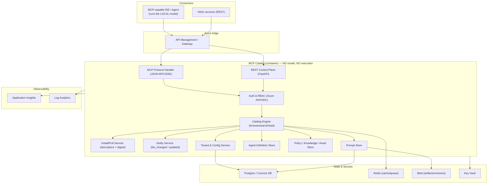
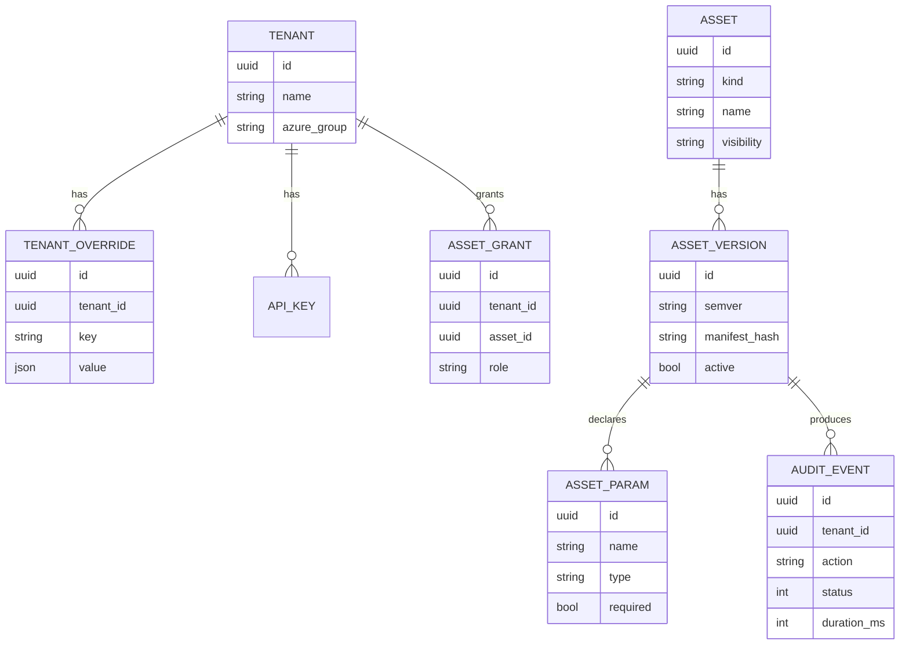

# MCP Catalog — Technical Architecture (modelless)

> Language: English (technical specification). Companion learning docs (Italian):
> [MCP-overview.md](../docs/learn/MCP-overview.md),
> [architettura.md](../docs/learn/architettura.md),
> [security_and_runtime.md](../docs/learn/security_and_runtime.md).

## 1. Purpose and scope

This document specifies the architecture of a **remote MCP catalog without models**
(à la awesome-copilot) that centralizes the **AI assets** of
`pagopa-platform-integration-test` (agents, skills, prompts, instructions) and exposes
them over the network to any QA team in the organization.

**Core principle**: the server is a **catalog, not an engine**. It hosts and calls
**no model** and **does not execute skills**. It only **distributes** versioned assets
(resources/prompts) plus deterministic **catalog operations** (search/read/install).
Assets are **ephemerally loaded** into a session or **hard-installed** as local files;
all reasoning and execution happen in the **client's local model** (the user's Copilot
seat).

**In scope**: agents (as definitions), skills, prompts, instructions/policies,
plugins/bundles; the three consumption modes (load, install, notify); multi-tenancy,
security, observability, Azure deployment.

**Out of scope**: any model/inference (stays local to the client); any server-side
skill execution; the Python test utilities (`src/utility`) remain in the source repo
as documented dependencies.

## 2. Design goals

| Goal | Description |
|---|---|
| Reusability | Any team/IDE can consume the same AI assets remotely (load or install) |
| Centralization | One source of truth, one place to update |
| Customization | Per-tenant overrides for style and declarative asset parameters |
| Security | Azure AD auth, RBAC, tenant isolation, catalog/install integrity (digest) |
| Simplicity | No model providers, no inference, no server-side execution, no token/cost accounting |
| Observability | Full audit of asset access (search/read/install), metrics |
| Portability | Standard MCP protocol (Streamable HTTP) + REST control plane |

## 3. Architecture overview

Two API surfaces sit on the same service:

1. **MCP protocol surface** (JSON-RPC over Streamable HTTP) — what MCP clients speak.
2. **REST control-plane surface** (OpenAPI) — for management, catalog, tenancy,
   health, metrics, and non-MCP integrations.

There is **no model router, no adapters, no provider connectivity, and no skill
execution runtime**. The server distributes assets; it does not run them.



## 4. Components

### 4.1 API Gateway (Azure API Management)
TLS termination, rate limiting, JWT validation offload, per-tenant subscription keys,
request routing to MCP and REST surfaces.

### 4.2 MCP Protocol Handler
Implements MCP over **Streamable HTTP**: `initialize`, `resources/list`,
`resources/read`, `resources/subscribe`, `prompts/list`, `prompts/get`, and the
**catalog tools** (`tools/list`, `tools/call` for `search`/`browse`/`install`). Emits
**notifications** (`resources/updated`, `list_changed`). Catalog tools are catalog
operations; they do **not** execute user skills.

### 4.3 REST Control Plane (FastAPI)
Management APIs (see [openapi.yml](openapi.yml)): catalog CRUD, tenant config,
health, metrics, discovery and install-descriptor access for non-MCP consumers.

### 4.4 Auth & RBAC
Azure AD / OIDC token validation; resolves `tenant` and `roles`; enforces
deny-by-default authorization on every asset access. Note: no model credentials are
handled, because the server calls no model.

### 4.5 Catalog Engine + Install/Notify Services
The **Catalog Engine** resolves and serves resources/prompts and answers
browse/search/read. The **Install/Pull Service** builds **install descriptors**
(target path, content, `source_version`, `source_digest`) that the client
**materializes** as files; it executes nothing. The **Notify Service** emits MCP
notifications for ephemeral loads and exposes each asset's current version for
installed-copy **drift detection**. No component calls a model or runs a skill.

### 4.6 Prompt Store
Versioned prompt templates with typed arguments; resolves base + tenant + request
overrides and returns the resolved text for the client's local model to consume.

### 4.7 Agent Definition Store
Serves versioned agent definitions as resources. The server does **not** orchestrate
or run agents; the client's local model interprets and orchestrates them.

### 4.8 Policy / Knowledge Store
Instructions/conventions exposed as MCP resources; the client uses them as grounding
context for its local model.

### 4.9 Tenant & Config Service
Per-tenant catalog visibility (public/private), overrides (style, declarative asset
params), request quotas, and SLAs. No preferred-model override and no token quotas.

## 5. Data model (logical)

Note: there are **no fields related to models or tokens**.



- `kind ∈ { agent, skill, prompt, policy, plugin }`.
- `visibility ∈ { public, private }`.
- Versions are **immutable** (semver + digest); activation toggles which version is
  served and which installed copies compare against for drift.

## 6. Override resolution

Precedence (lowest → highest):

```text
asset default  <  tenant override  <  request-time parameter
```

The Config Service merges these deterministically before serving an asset. There is
no model-related override.

## 7. Deployment topologies

### 7.1 Enterprise (recommended)
AKS + API Management + ACR + Key Vault + Application Insights + Postgres +
Redis + Blob. Best for scale, isolation tiers, and network policies. No Azure OpenAI.

### 7.2 Minimal (fast start)
Azure Container Apps + Container Registry + Key Vault + Application Insights +
managed Postgres + managed Redis. Lower ops overhead; good for MVP.

See [infra/azure/README.md](../infra/azure/README.md) for both.

## 8. Non-functional requirements

| NFR | Target (initial) |
|---|---|
| Availability | 99.5% (MVP) → 99.9% (GA) |
| P95 latency (search/read/install) | < 300 ms |
| Auth | Azure AD OIDC, tokens ≤ 60 min |
| Tenant isolation | Logical (DB row-level) + network policy |
| Audit retention | 90 days (configurable) |
| Scalability | Horizontal, stateless core (serves content, no execution workers) |

Latency target is low because the server only serves content (no inference and no
skill execution on the critical path).

## 9. Key architectural decisions (ADR summary)

| ADR | Decision | Rationale |
|---|---|---|
| ADR-01 | MCP over Streamable HTTP | Remote multi-team access requires network transport |
| ADR-02 | Local actions stay client-side | Server must not act on consumer machines |
| ADR-03 | Immutable versioned assets | Reproducibility, safe rollout/rollback |
| ADR-04 | No model server-side | Reasoning stays in the client's local model; no provider dependency, no inference cost |
| ADR-05 | Catalog, not engine (no server-side skill execution) | The server distributes assets (load/install); execution happens in the local model. Security shifts to catalog integrity, provenance/signing, install digest verification, RBAC, and drift |
| ADR-06 | Managed Identity + Key Vault | No secrets in code/config |

## 10. Traceability to existing assets

See [analysis/mapping.md](../analysis/mapping.md) for the full asset → component map.
The MVP exposes high-portability assets first (Prompt Store, the `mermaid-flow` skill
as a **distributed** load/install asset, Gherkin/behave policies, and a single-agent
definition proof of concept orchestrated by the client's local model).
