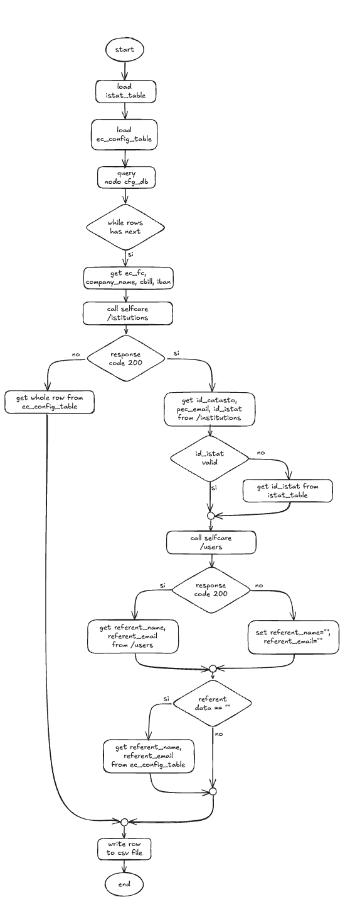

# README - CUP Config Updater

## Description
The purpose of the `cup-config-updater.py` script is to populate the Azure table `pagopapcanoneunicosaecconfigtable` with the necessary data for the operation of the component managing the payment of the Canone Unico Patrimoniale (CUP).
As described in the document below, the data pertains to creditor institutions and their respective Referente Pagamenti.
**The generated file `output.csv` is ready to be imported into the above-mentioned Azure Table using standard methods, e.g., via Azure Data Explorer.**

## Functionality
1. **Loading statistical codes** from a CSV file downloaded by [ISTAT web site](https://www.istat.it/storage/codici-unita-amministrative/Elenco-codici-statistici-e-denominazioni-delle-unità-territoriali.zip)
2. **Loading EC (Creditor Entities) configuration** from an export of the previous year’s `pagopapcanoneunicosaecconfigtable`, which will only be used if data for some entities is not available on SelfCare or in the Nodo configuration database.
   **NB: This file has not been uploaded as it contains sensitive data.**
3. **Executing a query on the Nodo configuration database (PostgreSQL)** to retrieve IBAN data associated with creditor institutions along with other additional information.
4. **Calling two REST APIs exposed by SelfCare** to enrich the data with additional details.
5. **Saving the data in the final CSV file to be imported into the `pagopapcanoneunicosaecconfigtable` table.**

## Flow Diagram
Below is the flowchart of the process executed by the script:



## Configuration Parameters
The script uses environment variables to configure connection parameters and file paths. Make sure to correctly set the following parameters:

| Environment Variable      | Description |
|--------------------------|-------------|
| `PG-DB-NAME`            | PostgreSQL database name |
| `PG-USER-NAME`          | Database username |
| `PG-USER-PASSWORD`      | Database access password |
| `PG-HOST`               | Database host |
| `PG-PORT`               | Database port |
| `API-INSTITUTION-URL`   | URL to retrieve creditor institution information |
| `API-USERS-URL`         | URL to retrieve Payment Representative information |
| `API-KEY`               | API key for authentication |
| `EC-CONFIG-TABLE`       | CSV file name containing creditor entity configuration |
| `STATISTICAL-CODES`     | CSV file name containing statistical codes |

## Output
The script generates a CSV file in the following path:
```
python/cup-config-update/output.csv
```
The CSV file will contain the following fields:
- PartitionKey
- RowKey
- CompanyName
- CompanyName@type
- Iban
- Iban@type
- PaIdCatasto
- PaIdCatasto@type
- PaIdCbill
- PaIdCbill@type
- PaIdIstat
- PaIdIstat@type
- PaPecEmail
- PaPecEmail@type
- PaReferentEmail
- PaReferentEmail@type
- PaReferentName
- PaReferentName@type

## Running the Script
To run the script, ensure you have installed the necessary dependencies:

```bash
pip install -r requirements.txt
```

Then, execute the Python file:

```bash
python cup-config-updater.py
```
---

For further information, contact the `pagopa-qa` team!

